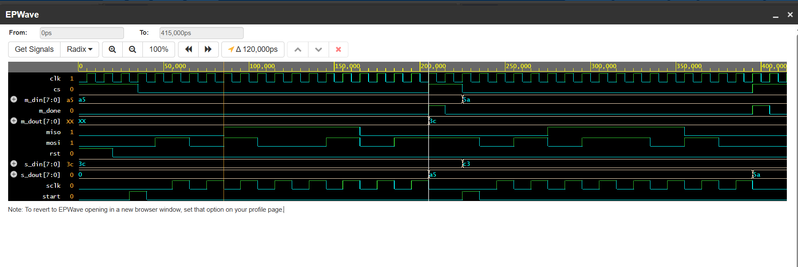

# spi-master-slave-verilog

# 8-Bit SPI Master-Slave Interface (Verilog RTL)

A synchronous, full-duplex Serial Peripheral Interface (SPI) Master-Slave implementation in Verilog HDL, verified using Icarus Verilog and EPWave on EDA Playground.

---

## Features
- **Protocol:** SPI Mode 0 (CPOL = 0, CPHA = 0).
- **Data Width:** 8-bit full-duplex serial transfer.
- **Clocking:** SCLK generated by Master; data sampled on the rising edge and shifted on the falling edge.
- **Active-Low Chip Select (CS):** Synchronizes start and end of byte frame.

---

## Signal Interface

| Signal | Direction (Master) | Direction (Slave) | Description |
| :--- | :--- | :--- | :--- |
| `clk` | Input | - | System clock |
| `rst` | Input | Input | Asynchronous active-high reset |
| `cs` | Output | Input | Active-low chip select |
| `sclk`| Output | Input | SPI serial clock |
| `mosi`| Output | Input | Master Out, Slave In serial data |
| `miso`| Input | Output | Master In, Slave Out serial data |

---

## Simulation Waveforms

### Verification Summary:
- **Transaction 1:** 
  - Master transmits: `0xA5`
  - Slave transmits: `0x3C`
  - Result: Master receives `0x3C`, Slave receives `0xA5` simultaneously.
- **Transaction 2:** 
  - Master transmits: `0x5A`
  - Slave transmits: `0xC3`
  - Result: Master receives `0xC3`, Slave receives `0x5A` simultaneously.

---

## How to Run
1. Load `rtl/spi_master.v`, `rtl/spi_slave.v`, and `tb/spi_tb.v` into **EDA Playground**.
2. Select **Icarus Verilog** as the simulator.
3. Check **Open EPWave after run**.
4. Click **Run** to view waveforms.
